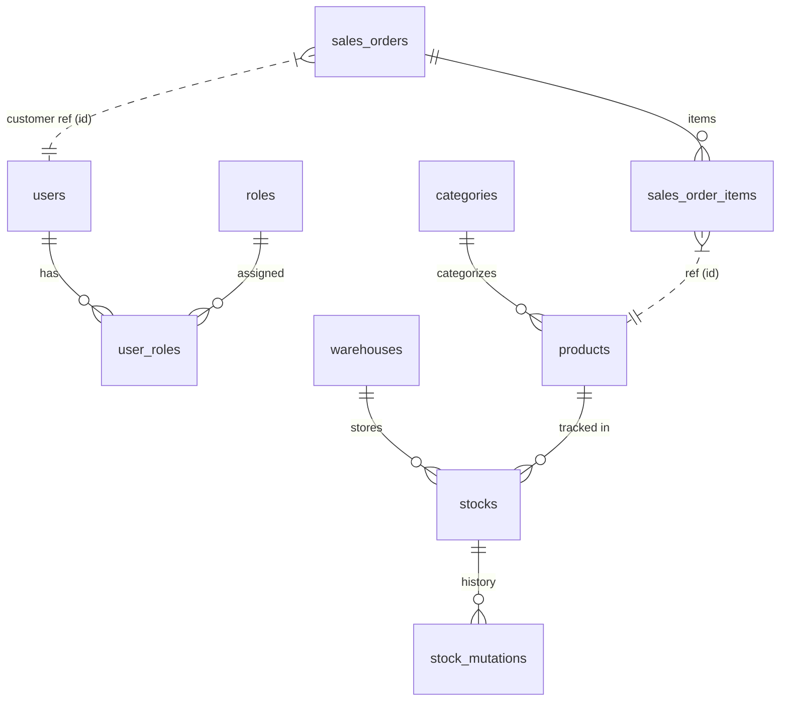

# Enterprise ERP - Database Design & Entity Mapping

This document contains database table specifications and Java Entity (JPA) mapping guidelines. Use this guide to create `@Entity` classes.

## Legend

| Term            | Full Name      | Description                                                      |
| :-------------- | :------------- | :--------------------------------------------------------------- |
| **PK**          | Primary Key    | Unique identifier for each row (usually ID).                     |
| **FK**          | Foreign Key    | Reference to a PK in another table (relation).                   |
| **UK**          | Unique Key     | Data in this column must be unique (no duplicates).              |
| **Auto Inc**    | Auto Increment | ID value increases automatically (1, 2, 3, etc.).                |
| **Soft Delete** | -              | Data is not physically deleted, only marked as `active = false`. |

---

## Design Principles (for Learning)

1. Normalize data to at least 3rd Normal Form (3NF) but keep it practical.
2. Use surrogate keys (`BIGINT` + Auto Increment) for most PKs.
3. Use `VARCHAR` for enums (store the enum name, not integer code).
4. Use `DECIMAL(19,4)` + `BigDecimal` for money.
5. Use audit columns (`created_at`, `updated_at`, etc.) in most business tables.
6. Use soft delete (`active` flag) only where it makes sense (Users, Products).
7. Add indexes on columns that are frequently searched or used as FK.

---

---

## Base Entity (MappedSuperclass)

Every table (except `many-to-many` join tables) should ideally have audit columns. In Java, we use a `BaseEntity` class as a mapped superclass to hold these fields.

| Column Name  | SQL Type    | Java Type       | Description                         |
| :----------- | :---------- | :-------------- | :---------------------------------- |
| `created_at` | TIMESTAMP   | `LocalDateTime` | Creation timestamp                  |
| `updated_at` | TIMESTAMP   | `LocalDateTime` | Last update timestamp               |
| `created_by` | VARCHAR(50) | `String`        | Username of creator (max 50 chars)  |
| `updated_by` | VARCHAR(50) | `String`        | Username of updater (max 50 chars)  |

---

## 1. Module: User (`com.learn.erp_core.user`)

Handles users, roles, and permissions.

### Table: `users`

| Column          | SQL Type     | Java Type | Constraints  | Note                          |
| :-------------- | :----------- | :-------- | :----------- | :---------------------------- |
| `id`            | BIGINT       | `Long`    | PK, Auto Inc |                               |
| `username`      | VARCHAR(50)  | `String`  | UK, Not Null |                               |
| `email`         | VARCHAR(100) | `String`  | UK, Not Null |                               |
| `password_hash` | VARCHAR(255) | `String`  | Not Null     | Store BCrypt hash             |
| `is_active`     | BOOLEAN      | `Boolean` | Default True | Soft delete flag (`true`/`false`) |

### Table: `roles`

| Column        | SQL Type     | Java Type | Constraints  | Note                  |
| :------------ | :----------- | :-------- | :----------- | :-------------------- |
| `id`          | BIGINT       | `Long`    | PK, Auto Inc |                       |
| `name`        | VARCHAR(50)  | `String`  | UK, Not Null | ROLE_ADMIN, ROLE_USER |
| `description` | VARCHAR(255) | `String`  |              |                       |

### Table: `permissions`

| Column        | SQL Type      | Java Type | Constraints  | Note                                |
| :------------ | :------------ | :-------- | :----------- | :---------------------------------- |
| `id`          | BIGINT        | `Long`    | PK, Auto Inc |                                      |
| `name`        | VARCHAR(100)  | `String`  | UK, Not Null | PRODUCT_READ, ORDER_CREATE           |
| `description` | VARCHAR(255)  | `String`  |              | Optional permission description text |

### Relations (Join Tables)

- `users` ↔ `roles` (Many-to-Many): Table `user_roles`
- `roles` ↔ `permissions` (Many-to-Many): Table `role_permissions`

#### Table: `user_roles`

| Column    | SQL Type | Java Type | Constraints                   | Note                              |
| :-------- | :------- | :-------- | :---------------------------- | :-------------------------------- |
| `user_id` | BIGINT   | `Long`    | PK (composite), FK (users.id) | One user can have many roles      |
| `role_id` | BIGINT   | `Long`    | PK (composite), FK (roles.id) | One role can be assigned to users |

Recommended:

- Composite PK: `PRIMARY KEY (user_id, role_id)`
- Index: index on `role_id` for reverse lookup (find all users by role).

#### Table: `role_permissions`

| Column          | SQL Type | Java Type | Constraints                         | Note                               |
| :-------------- | :------- | :-------- | :---------------------------------- | :--------------------------------- |
| `role_id`       | BIGINT   | `Long`    | PK (composite), FK (roles.id)       | One role can have many permissions |
| `permission_id` | BIGINT   | `Long`    | PK (composite), FK (permissions.id) | One permission can belong to roles |

Recommended:

- Composite PK: `PRIMARY KEY (role_id, permission_id)`
- Index: index on `permission_id` for reverse lookup (find all roles by permission).

#### Enum Strategy (Auth)

- `roles.name`: store string like `ROLE_ADMIN`, `ROLE_USER`.
- `permissions.name`: store string like `PRODUCT_READ`, `ORDER_CREATE`.

---

## 2. Module: Catalog (`com.learn.erp_core.catalog`)

Product and category module.

### Table: `categories`

| Column        | SQL Type     | Java Type | Constraints     | Note                         |
| :------------ | :----------- | :-------- | :-------------- | :--------------------------- |
| `id`          | BIGINT       | `Long`    | PK, Auto Inc    |                              |
| `name`        | VARCHAR(100) | `String`  | UK, Not Null    |                              |
| `description` | TEXT         | `String`  |                 |                              |
| `parent_id`   | BIGINT       | `Long`    | FK (categories) | Self-join for sub-categories |

### Table: `products`

| Column        | SQL Type      | Java Type    | Constraints     | Note                      |
| :------------ | :------------ | :----------- | :-------------- | :------------------------ |
| `id`          | BIGINT        | `Long`       | PK, Auto Inc    |                           |
| `sku`         | VARCHAR(50)   | `String`     | UK, Not Null    | Stock Keeping Unit        |
| `name`        | VARCHAR(150)  | `String`     | Not Null        |                           |
| `description` | TEXT          | `String`     |                 |                           |
| `price`       | DECIMAL(19,4) | `BigDecimal` | Not Null        | Use BigDecimal for money  |
| `uom`         | VARCHAR(20)   | `String`     | Not Null        | Unit of Measure (PCS, KG) |
| `category_id` | BIGINT        | `Long`       | FK (categories) |                           |
| `active`      | BOOLEAN       | `Boolean`    | Default True    |                           |

Recommended constraints and indexes:

- `UK_products_sku` on `sku`.
- Index on `category_id` to speed up filtering by category.
- If search by name is common, consider index on `name` (partial or full text depending on DB).

---

## 3. Module: Inventory (`com.learn.erp_core.inventory`)

Warehouse stock module.

### Table: `warehouses`

| Column    | SQL Type     | Java Type | Constraints  | Note                    |
| :-------- | :----------- | :-------- | :----------- | :---------------------- |
| `id`      | BIGINT       | `Long`    | PK, Auto Inc |                         |
| `code`    | VARCHAR(20)  | `String`  | UK, Not Null | Warehouse Code (WH-JKT) |
| `name`    | VARCHAR(100) | `String`  | Not Null     |                         |
| `address` | TEXT         | `String`  |              |                         |

### Table: `stocks`

| Column              | SQL Type | Java Type | Constraints     | Note                        |
| :------------------ | :------- | :-------- | :-------------- | :-------------------------- |
| `id`                | BIGINT   | `Long`    | PK, Auto Inc    |                             |
| `product_id`        | BIGINT   | `Long`    | Not Null        | **Logical FK** to Catalog   |
| `warehouse_id`      | BIGINT   | `Long`    | FK (warehouses) |                             |
| `quantity_on_hand`  | INTEGER  | `Integer` | Not Null        | Physical stock in warehouse |
| `quantity_reserved` | INTEGER  | `Integer` | Not Null        | Stock reserved for orders   |

Recommended:

- Ensure there is only one stock row per product per warehouse:
  - `UNIQUE(product_id, warehouse_id)`
- Index on `(product_id, warehouse_id)` for fast lookup.

### Table: `stock_mutations`

| Column         | SQL Type    | Java Type | Constraints  | Note                          |
| :------------- | :---------- | :-------- | :----------- | :---------------------------- |
| `id`           | BIGINT      | `Long`    | PK, Auto Inc |                               |
| `stock_id`     | BIGINT      | `Long`    | FK (stocks)  |                               |
| `type`         | VARCHAR(20) | `Enum`    | Not Null     | IN, OUT, ADJUSTMENT           |
| `quantity`     | INTEGER     | `Integer` | Not Null     | Quantity change (+/-)         |
| `reference_no` | VARCHAR(50) | `String`  | Not Null     | PO No / SO No / Adjustment No |
| `trx_date`     | TIMESTAMP   | `Instant` | Not Null     | Transaction date              |

---

## 4. Module: Partner (`com.learn.erp_core.partner`)

Suppliers and Customers.

### Table: `partners`

| Column    | SQL Type     | Java Type | Constraints  | Note               |
| :-------- | :----------- | :-------- | :----------- | :----------------- |
| `id`      | BIGINT       | `Long`    | PK, Auto Inc |                    |
| `type`    | VARCHAR(20)  | `Enum`    | Not Null     | CUSTOMER, SUPPLIER |
| `name`    | VARCHAR(100) | `String`  | Not Null     |                    |
| `email`   | VARCHAR(100) | `String`  |              |                    |
| `phone`   | VARCHAR(20)  | `String`  |              |                    |
| `address` | TEXT         | `String`  |              |                    |

---

## 5. Module: Sales & Procurement (`com.learn.erp_core.sales`, `com.learn.erp_core.procurement`)

Sales and Purchase transactions. Table structures are similar.

### Table: `purchase_orders` / `sales_orders`

| Column         | SQL Type      | Java Type    | Constraints  | Note                        |
| :------------- | :------------ | :----------- | :----------- | :-------------------------- |
| `id`           | BIGINT        | `Long`       | PK, Auto Inc |                             |
| `order_number` | VARCHAR(50)   | `String`     | UK, Not Null | PO-2024-001                 |
| `partner_id`   | BIGINT        | `Long`       | Not Null     | **Logical FK** to Partner   |
| `status`       | VARCHAR(20)   | `Enum`       | Not Null     | DRAFT, CONFIRMED, COMPLETED |
| `total_amount` | DECIMAL(19,4) | `BigDecimal` | Not Null     | Total price                 |
| `order_date`   | TIMESTAMP     | `Instant`    | Not Null     |                             |

### Table: `purchase_order_items` / `sales_order_items`

| Column        | SQL Type      | Java Type    | Constraints       | Note                               |
| :------------ | :------------ | :----------- | :---------------- | :--------------------------------- |
| `id`          | BIGINT        | `Long`       | PK, Auto Inc      |                                    |
| `order_id`    | BIGINT        | `Long`       | FK (Parent Order) |                                    |
| `product_id`  | BIGINT        | `Long`       | Not Null          | **Logical FK** to Catalog          |
| `quantity`    | INTEGER       | `Integer`    | Not Null          |                                    |
| `unit_price`  | DECIMAL(19,4) | `BigDecimal` | Not Null          | Price per item at transaction time |
| `total_price` | DECIMAL(19,4) | `BigDecimal` | Not Null          | qty \* unit_price                  |

Recommended:

- To avoid duplicate item rows for same product in one order:
  - `UNIQUE(order_id, product_id)`
- Index on `product_id` for reporting and analytics.

---

## Visual Diagram (Mermaid)

High-level relationship overview.

